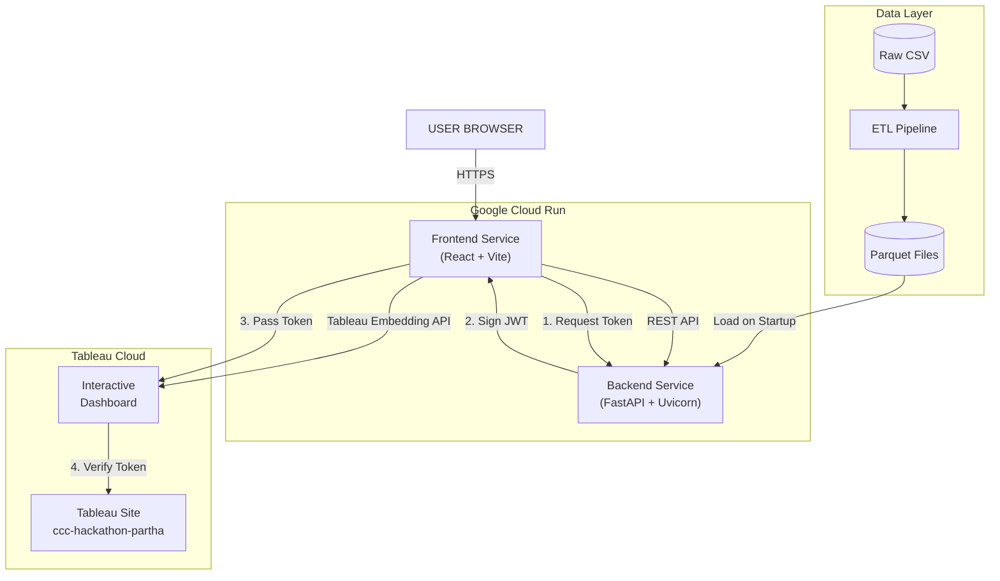
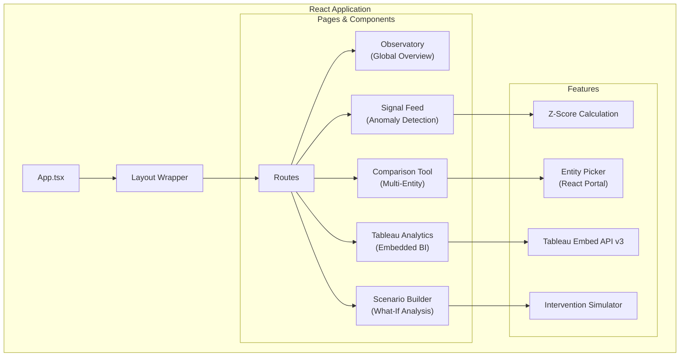
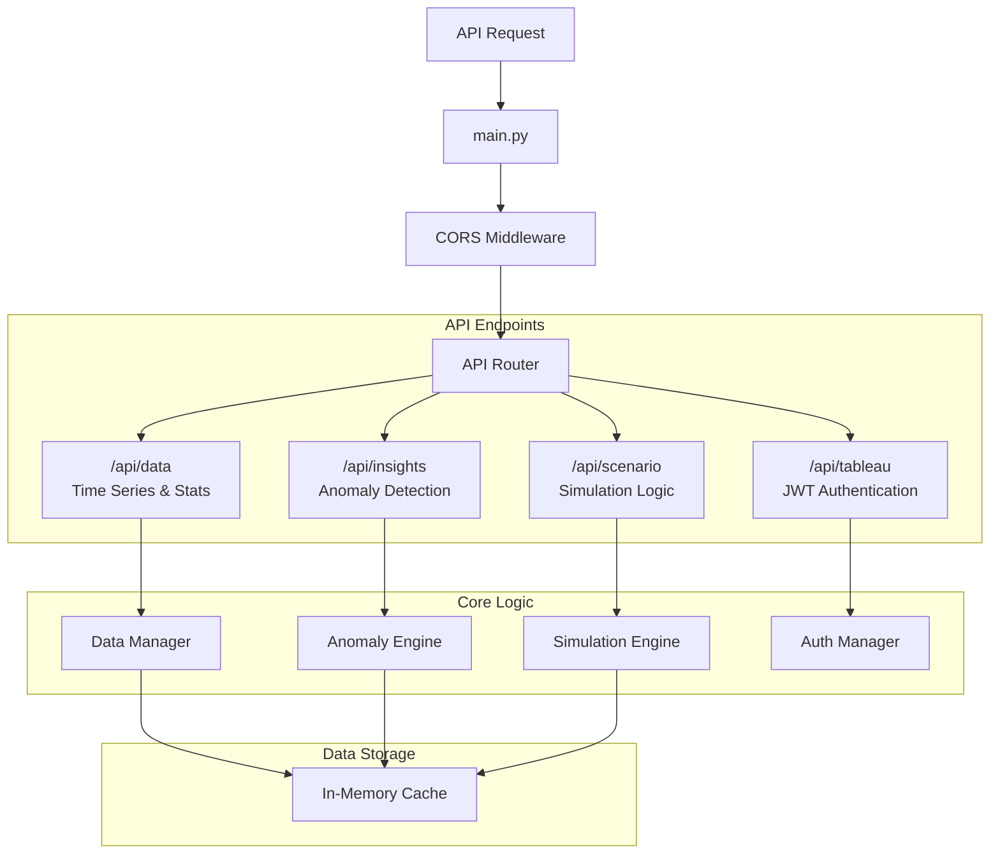
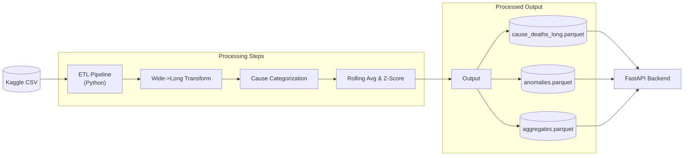

# 🏥 Mortality Signals

> **AI-Powered Global Mortality Analytics Platform**  
> *Tableau Hackathon 2025 Submission*

[](https://www.tableau.com/)
[](https://fastapi.tiangolo.com/)
[](https://reactjs.org/)
[](https://www.typescriptlang.org/)
[](LICENSE)

Transform global mortality data into **actionable intelligence** through AI-powered anomaly detection, scenario modeling, and interactive Tableau visualizations.

---

## 🎯 What Makes This a Winner

| Feature | Why It Matters |
|---------|----------------|
| **🔔 Signal Detection** | Z-score anomaly detection surfaces 4,500+ mortality anomalies automatically |
| **🎭 Scenario Builder** | "What-if" intervention modeling shows actionable lives-saved projections |
| **📊 Tableau Embedding** | Production-ready JWT-authenticated Tableau Cloud dashboards |
| **🔗 Peer Comparison** | Compare up to 6 countries with indexed/absolute views |
| **🎨 Observatory UI** | Professional dark/light theme designed for data analysts |

---

## 🖼️ Screenshots

### Global Observatory Dashboard
Real-time KPIs, 30-year trends, and cause category breakdowns.

### Signal Feed
AI-detected anomalies with severity levels (Critical/Warning/Info).

### Tableau Cloud Integration
Embedded dashboard showing Top 10 Causes of Death with interactive filters.

---

## 🏗️ Architecture

### Complete System Overview



### Frontend Architecture



### Backend Services



### Data Pipeline



---

## 🚀 Quick Start

### Prerequisites
- Python 3.10+
- Node.js 18+
- npm or yarn

### Option 1: Local Development (Recommended)

```bash
# Clone repository
git clone https://github.com/yourusername/mortality_signals_hackathon.git
cd mortality_signals_hackathon

# 1. Setup Python environment
python -m venv venv
source venv/bin/activate  # Windows: venv\Scripts\activate

# 2. Process data
cd etl
pip install pandas numpy pyarrow
python generate_sample_data.py  # Or use Kaggle CSV
python etl_pipeline.py
cd ..

# 3. Start Backend (Terminal 1)
cd api
pip install -r requirements.txt
cp .env.example .env  # Configure Tableau credentials
uvicorn main:app --reload --port 8000

# 4. Start Frontend (Terminal 2)
cd web
npm install
npm run dev
```

**Access:**
- 🌐 Live App: https://ccc-tableau-cloud-108816008638.us-central1.run.app
- 📖 API Docs: https://mortality-signals-api-fozkypxpga-uc.a.run.app/docs
- 📊 Tableau: https://ccc-tableau-cloud-108816008638.us-central1.run.app/tableau

### Option 2: Docker Compose

```bash
# Build and start all services
docker compose up --build

# Same access URLs as above
```

---

## 🔧 Configuration

### Environment Variables (.env)

```bash
# Tableau Cloud Integration
TABLEAU_BASE_URL=https://10ax.online.tableau.com
TABLEAU_SITE_CONTENT_URL=ccc-hackathon-partha
TABLEAU_CLIENT_ID=your-client-id
TABLEAU_SECRET_ID=your-secret-id
TABLEAU_SECRET_VALUE=your-secret-value  # ⚠️ NEVER commit!
TABLEAU_EMBED_USER=your-email@example.com

# API Settings
CORS_ORIGINS=http://localhost:5173,http://localhost:3000
```

### Tableau Connected App Setup

1. Go to Tableau Cloud → Settings → Connected Apps
2. Create new Connected App (Direct Trust)
3. Enable embedding
4. Set domain allowlist: `localhost:5173` or `*` for testing
5. Copy Client ID, Secret ID, and Secret Value to `.env`

---

## 📁 Project Structure

```
mortality_signals_hackathon/
├── api/                          # FastAPI Backend
│   ├── main.py                   # Application entry
│   ├── routers/
│   │   ├── data.py               # Data endpoints
│   │   ├── insights.py           # AI anomaly detection
│   │   ├── scenario.py           # What-if modeling
│   │   ├── clustering.py         # Peer comparison
│   │   ├── tableau.py            # JWT authentication
│   │   └── export.py             # Tableau data export
│   └── requirements.txt
│
├── web/                          # React Frontend
│   ├── index.html                # Entry + Tableau API script
│   ├── src/
│   │   ├── App.tsx               # Router setup
│   │   ├── components/
│   │   │   ├── Dashboard/        # Dashboard, Compare, Scenario
│   │   │   ├── Layout/           # Shell, navigation
│   │   │   ├── Insights/         # Signal feed
│   │   │   ├── Tableau/          # Tableau embedding
│   │   │   └── Embed/            # Embeddable widget
│   │   ├── services/             # API client
│   │   └── styles/               # CSS + themes
│   ├── tailwind.config.js
│   └── vite.config.ts
│
├── etl/                          # Data Pipeline
│   ├── etl_pipeline.py           # Main ETL
│   └── generate_sample_data.py   # Demo data generator
│
├── data/
│   ├── raw/                      # Kaggle CSV
│   └── processed/                # Parquet files
│
├── docs/
│   ├── TABLEAU_SETUP.md
│   └── ENV_SETUP.md
│
├── docker-compose.yml
└── README.md
```

## 📄 API Reference

### Data Endpoints
| Endpoint | Method | Description |
|----------|--------|-------------|
| `/api/data/global-stats` | GET | Global statistics and KPIs |
| `/api/data/entities` | GET | List all 61 entities |
| `/api/data/causes` | GET | List all 30 causes |
| `/api/data/global-trend` | GET | Yearly mortality totals |
| `/api/data/timeseries` | GET | Entity/cause time series |

### Insights Endpoints
| Endpoint | Method | Description |
|----------|--------|-------------|
| `/api/insights/signals` | GET | Anomaly signal feed |
| `/api/insights/anomaly/{id}` | GET | Specific anomaly details |

### Scenario Endpoints
| Endpoint | Method | Description |
|----------|--------|-------------|
| `/api/scenario/simulate` | GET | Run what-if simulation |
| `/api/scenario/interventions` | GET | Pre-built templates |

### Tableau Endpoints
| Endpoint | Method | Description |
|----------|--------|-------------|
| `/api/tableau/embed-token` | GET | Generate JWT for embedding |
| `/api/tableau/config` | GET | Tableau configuration |
| `/api/export/tableau-ready` | GET | Tableau-optimized JSON |
| `/api/export/csv/main` | GET | Full CSV export |

---

## 🏆 Hackathon Checklist

- [x] **Novel Concept**: AI Signals + What-If Scenarios = Decision Intelligence
- [x] **Clear Story**: Problem → Detection → Analysis → Action
- [x] **Tableau Integration**: JWT-authenticated embedding, data export
- [x] **Technical Merit**: FastAPI, React, Z-score anomaly detection
- [x] **Polished UI**: Dark/light themes, responsive design
- [x] **Security**: Server-side secrets, CORS, input validation
- [x] **Documentation**: Architecture diagrams, API reference, demo script

---

## 🔮 Future Enhancements

- [ ] Real-time data streaming (Kafka)
- [ ] Advanced forecasting (Prophet/ARIMA)
- [ ] User authentication (OIDC)
- [ ] Alert subscriptions & email notifications
- [ ] Tableau Pulse integration
- [ ] Mobile-responsive design
- [ ] Kubernetes deployment

---

## 📜 License

MIT License - See [LICENSE](LICENSE)

---

## 👥 Team

**Hackathon Team**: Counterfactual Command Center

---

<p align="center">
  <strong>Built for the Tableau Hackathon 2025</strong><br>
  <em>Turning mortality data into actionable intelligence</em>
</p>

---

## 🔗 Links

- **Live App**: [Mortality Signals Demo](https://ccc-tableau-cloud-108816008638.us-central1.run.app)
- **Tableau Cloud Dashboard**: [GlobalOverview/Dashboard1](https://10ax.online.tableau.com/#/site/ccc-hackathon-partha/views/GlobalOverview/Dashboard1)
- **Kaggle Dataset**: [Annual Cause of Death Numbers](https://www.kaggle.com/datasets/willianoliveiragibin/annual-cause-death-numbers)
